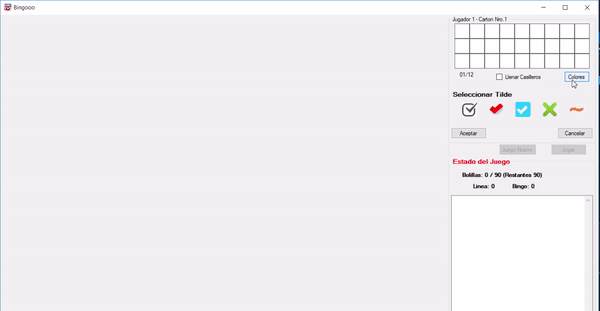
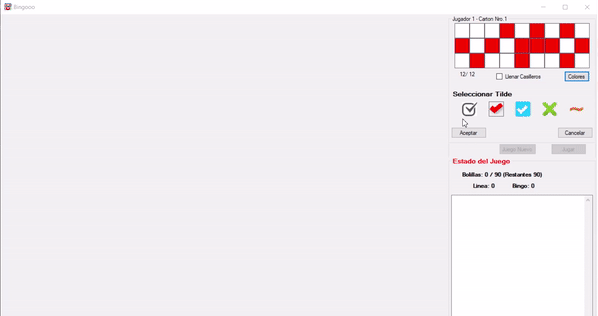

# Practicas delegate-event con VB.NET
Clásico Juego `Bingo` creado en VB.NET para realizar practicas con `delegate-pattern`

- El juego permite agregar jugadores de forma manual como también automática, indicando para este ultimo caso el numero de jugadores.
- El numero máximo de jugadores es 15.
- Para cada nuevo jugador se solicitara ingresar el nombre.
- Los números `cantados` por la mesa pueden ser manual o automáticamente.
- Más de un jugador puede acertar linea o bingo en simultaneo.

## Creación jugador manualmente
- Deberá seleccionar el tilde deseado para marcar el casillero del cartón ante un acierto.
- Deberá seleccionar aquellos casilleros que no serán utilizados, es decir diseñar el cartón.
- Color del cartón personalizable.
- Los números asignados pueden ser ingresados de forma manual o bien automáticamente seleccionados por el juego.

  ### Creacion carton Manual con asignacion automatica de numeros
    
  
  ### Creacion carton Manual con asignacion manual de numeros
    
